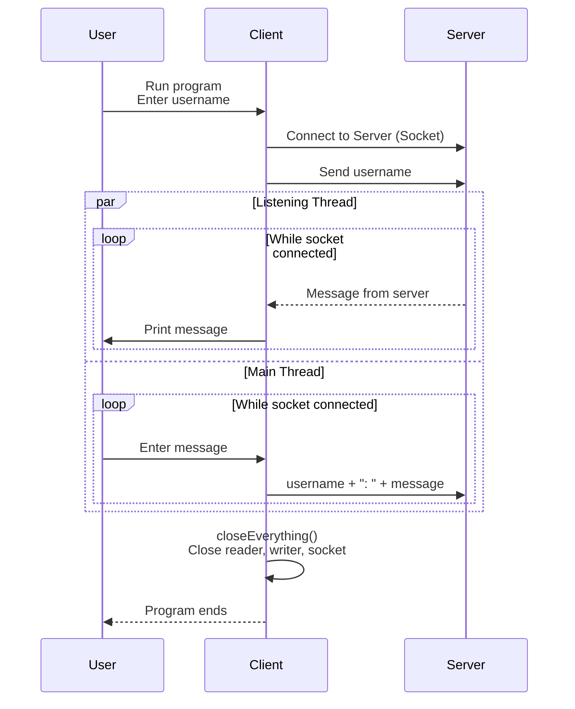

```mermaid
sequenceDiagram
    participant U as User
    participant C as Client
    participant S as Server

    U->>C: Run program<br/>Enter username
    C->>S: Connect to Server (Socket)
    C->>S: Send username

    par Listening Thread
        loop While socket connected
            S-->>C: Message from server
            C->>U: Print message
        end
    and Main Thread
        loop While socket connected
            U->>C: Enter message
            C->>S: username + ": " + message
        end
    end

    C->>C: closeEverything()<br/>Close reader, writer, socket
    C-->>U: Program ends
```
